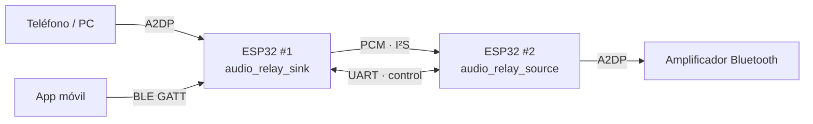
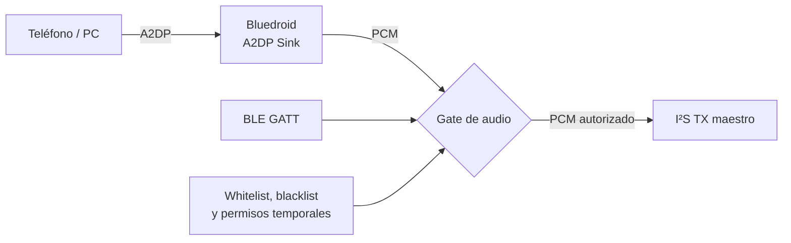
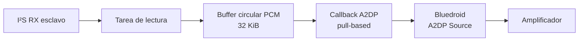
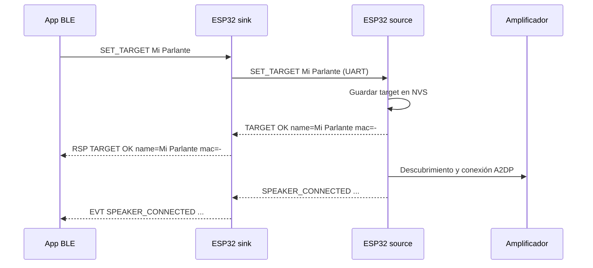
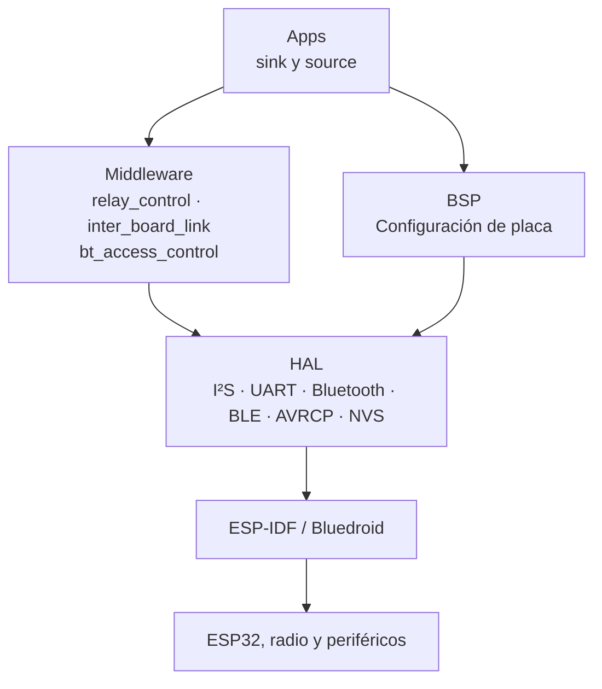

# Un puente de audio Bluetooth administrable con dos ESP32

`audio_relay_sink` y `audio_relay_source` forman un puente de audio Bluetooth en dos etapas. Un teléfono o PC transmite audio al primer ESP32; este lo convierte a PCM y lo envía por I²S a un segundo ESP32, que lo retransmite por Bluetooth a un amplificador. Un enlace UART adicional permite administrar el amplificador final desde la misma app BLE que controla el sink.



Separar los roles en dos microcontroladores responde a una limitación de Bluedroid: un ESP32 no puede trabajar a la vez como A2DP Sink y A2DP Source. El primer chip recibe audio; el segundo lo vuelve a transmitir.

## El sink: entrada de audio y plano de control

`audio_relay_sink` aparece como **Audio Relay Sink** ante teléfonos y PCs. Su papel es recibir A2DP, obtener PCM estéreo de 16 bits a 44,1 kHz y transmitirlo por I²S.



El gate aplica tres reglas antes de publicar cada bloque: la transmisión debe estar habilitada, el peer Bluetooth debe pasar los filtros MAC y una eventual concesión de tiempo debe continuar vigente.

El sink expone un servicio BLE GATT con UUID `0xFFC0`: la característica CMD (`0xFFC1`) recibe líneas ASCII, RSP (`0xFFC2`) devuelve respuestas y EVT (`0xFFC3`) publica eventos. De este modo la app no necesita conectarse al segundo ESP32 ni conocer su existencia.

## I²S: audio PCM entre las placas

El sink funciona como maestro I²S y el source como esclavo. Solo el sink genera los relojes, evitando contención en el bus.

| Señal | GPIO |
|---|---:|
| BCLK | 26 |
| WS / LRCLK | 25 |
| DATA | 22 |
| GND | común |

Las conexiones son `BCLK-BCLK`, `WS-WS`, `DATA-DATA` y `GND-GND`. Con el formato actual, el enlace transporta aproximadamente 1,41 Mbit/s:

```text
44.100 muestras/s × 2 canales × 16 bits = 1.411.200 bit/s
```

## El source: salida A2DP configurable

`audio_relay_source` recibe el PCM desde I²S y funciona como A2DP Source frente al amplificador. Como ESP-IDF 6.x usa un modelo *pull-based*, Bluedroid pide las muestras mediante un callback cuando necesita generar una trama A2DP.



La tarea principal lee bloques de hasta 1024 bytes y los coloca en un buffer circular de 32 KiB. El callback Bluetooth consume los bytes solicitados. Si no hay suficientes muestras, completa con silencio para mantener la temporización; si el buffer está lleno, se descartan muestras nuevas y se registra una advertencia, evitando aumentar la latencia indefinidamente.

El target ya no está hardcodeado. El source guarda el nombre o MAC configurado en NVS. Al arrancar, intenta conectarse solo si existe un target persistido; si no, espera una orden del sink. Al perder la conexión, reintenta cada tres segundos contra el target configurado.

## UART: el plano de control entre placas

I²S transporta audio, no comandos. Por eso se agregó UART1 a 115200 baudios, 8N1, con líneas ASCII terminadas en `\n`.

| Señal | Sink | Source |
|---|---:|---:|
| TX → RX | GPIO 32 | GPIO 32 |
| RX ← TX | GPIO 33 | GPIO 33 |
| GND | común | común |

Aunque los números GPIO coinciden, las señales están cruzadas por dirección: GPIO 32 del sink es TX y GPIO 32 del source es RX; GPIO 33 del source es TX y GPIO 33 del sink es RX.



El middleware `inter_board_link` mantiene este protocolo independiente del transporte: usa la HAL UART para framing y entrega líneas a callbacks. Las solicitudes no bloquean el procesamiento BLE. Si el source no responde en dos segundos, el sink informa `ERR TARGET_TIMEOUT` por RSP.

## Nuevos comandos disponibles desde BLE

Todos los comandos siguen llegando a CMD del servicio GATT del sink. La app solo habla BLE; el sink reenvía por UART los que corresponden al source.

| Comando | Acceso | Acción |
|---|---|---|
| `SCAN_TARGET` | autenticado | Inicia un escaneo Bluetooth Classic en el source |
| `SET_TARGET <nombre_o_MAC>` | autenticado | Persiste y aplica el amplificador destino |
| `GET_TARGET` | lectura | Consulta target y estado de conexión |

Las respuestas relevantes son:

```text
TARGET OK name=... mac=...
TARGET name=... mac=... connected=0|1
ERR TARGET_TIMEOUT
```

Durante un escaneo y al cambiar el estado de conexión, el source emite eventos que el sink publica por BLE EVT:

```text
SPEAKER_FOUND name=... mac=...
SPEAKER_CONNECTED name=... mac=...
SPEAKER_DISCONNECTED name=... mac=...
```

## Arquitectura por capas



`relay_control` conserva la política de seguridad y el protocolo BLE. Cuando recibe un comando de configuración de parlante, lo delega de forma asíncrona al source mediante `inter_board_link`. La respuesta o evento retorna por UART y se publica al cliente BLE.

El resultado es un relay de audio administrable de punta a punta: el usuario elige desde la app qué amplificador Bluetooth debe usar el segundo ESP32, sin intervenir físicamente en la placa source ni modificar firmware para cambiar el nombre del parlante.
